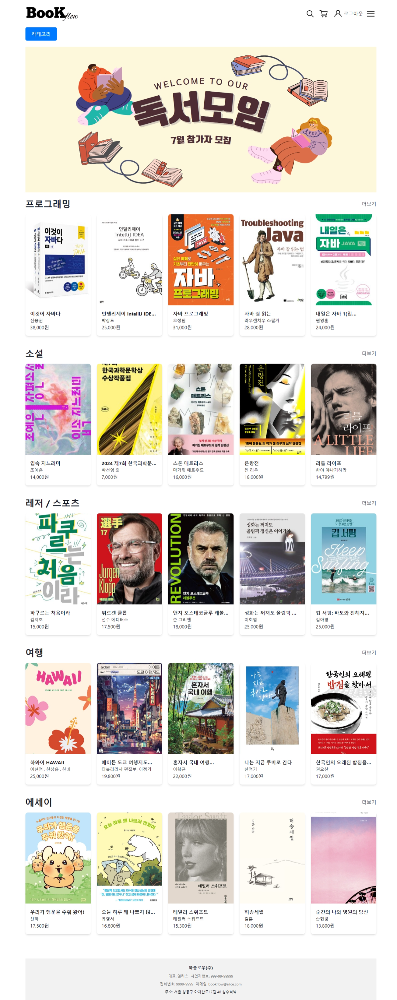

# BookFlow - 지식과 이야기가 흐르는 곳

## 프로젝트 소개
책을 통해 배움을 얻고,  
다양한 가치를 발견할 수 있는 공간을 제공하는 것을 목표로 합니다.  
사용자들이 쉽게 원하는 책을 찾고, 구입하여 읽을 수 있도록 하는 것이 BookFlow의 주된 목적입니다. 

## 기능
- 회원가입 / 로그인
- 도서 제목 검색
- 장바구니 기능
- 주문
- 마이 페이지
- ...

## 프로젝트 팀 페이지
https://www.notion.so/elice-track/10-197e4fe6eb8e4bf59898e73639f75cc3?pvs=4
